<center># iOS7 MultiTasking</center>

本文主要结合Apple一系列官方文档、WWDC、以及相关博文的学习，并配合自己的一系列测试，对iOS7之后的多任务进行了总结。在了解iOS的多任务方式之前，对于iOS的应用程序的生命周期也需要有个清晰的认识。所以，文章将按照如下章节来介绍iOS7及其后系统多任务的新特性：

* iOS应用程序运行状态
* iOS多任务的发展
* iOS7多任务之新特性

## iOS应用程序运行状态

应用程序的状态有以下状态：

1. Not Running: App已经终止，或者还未启动
2. InActive : App处于前台但不再接收事件（eg:用户处于活动时锁住了设备）。
3. Active	 : App处于在前台运行而且接收到了事件，这是前台的一个正常模式
4. Background : 程序在后台而且能执行代码，大多数程序进入这个状态后会在在这个状态上停留一会。时间到之后会进入挂起状态(Suspended)。有的程序经过特殊的请求后可以长期处于Backgroud状态
5. Suspend : App驻留内存，但不再执行代码。系统会自动把程序变成这个状态而且不会发出通知。当挂起时，程序还是停留在内存中的，当系统内存低时，系统就把挂起的程序清除掉，为前台程序提供更多的内存。

下图是应用程序各状态的变化图：

<center>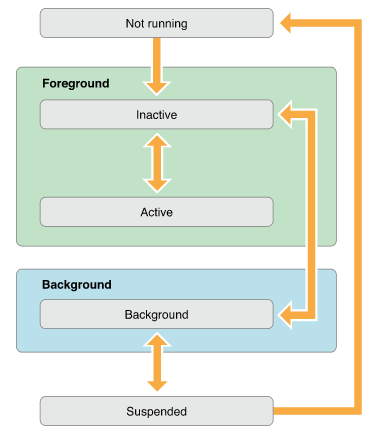</center>

对应不同状态切换时，会触发delegate对象对应的方法来响应app的状态改变。了解这些方法，在app状态发生转换时，可以更合理地选择相应的方法，执行我们期待的操作。

```
告诉代理对象，应用启动过程结束，准备开始运行
- (BOOL)application:(UIApplication *)application didFinishLaunchingWithOptions:(NSDictionary *)launchOptions

当应用程序将要入非活动状态执行，在此期间，应用程序不接收消息或事件，比如来电话了
- (void)applicationWillResignActive:(UIApplication *)application

当应用程序入活动状态执行，这个刚好跟上面那个方法相反
- (void)applicationDidBecomeActive:(UIApplication *)application 

当程序被推送到后台的时候调用。所以要设置后台继续运行，则在这个函数里面设置即可
- (void)applicationDidEnterBackground:(UIApplication *)application

当程序从后台将要重新回到前台时候调用，这个刚好跟上面的那个方法相反。
- (void)applicationWillEnterForeground:(UIApplication *)application

当程序将要退出是被调用，通常是用来保存数据和一些退出前的清理工作。这个需要要设置UIApplicationExitsOnSuspend的键值。
- (void)applicationWillTerminate:(UIApplication *)application
```

更具体的介绍，可以参考这篇博文：[iOS应用程序生命周期](http://blog.csdn.net/totogo2010/article/details/8048652)


## iOSx多任务发展

1、IOS 4之前: app并不存在后台的概念，只要Home键按下，app就被干掉。

2、IOS 4: 引入了后台和多任务，但实际上是伪多任务。它仅支持少数几类服务在通过注册后可以真正在后台运行，而一般的app后台并不能执行自己的代码。

3、IOS 5、6: 能后台运行的服务种类增加，但后台的本质没有变化
	
总结下来，iOS7之前，系统所接受的应用多任务大致分为以下几种:

* 后台完成某些花费时间的特定任务(通过beginBackgroundTaskWithExpirationHandler:实现)
* 后台播放音乐
* Location Service
* IP 电话
* NewsStand

而iOS7作为多任务发展的转折点，不仅改变了之前后台任务的处理方式，还加入了全新的后台模式。以下列出iOS7多任务的新特性:

* 改变了后台任务的运行方式
* 新特性之一——Background Fetch
* 新特性之二——Slient Remote Notifications
* 新特性之三——Background Transfer Service
	
除了这些新特性以外，当然它仍然继续支持一些诸如IP电话等特殊服务。不过，本文的调研路线主要focus在iOS7多任务的四类新特性上。

##iOS7的多任务之新特性
关于本章节的所有Demo都是基于iOS7以上的系统测试的。
###Finite-length Background Task

1、后台任务的运行方式

**后台执行有限时长的任务**，这是自iOS4以来就存在的一种后台模式。严格上来说，它并不是真正意义上的后台模式。它只是UIApplication提供的一个API，通过此API我们可以实现后台任务执行的一种方式:

```
-(UIBackgroundTaskIdentifier)beginBackgroundTaskWithName:expirationHandler:
or
-(UIBackgroundTaskIdentifier)beginBackgroundTaskWithExpirationHandler:
```
通过此API，我们可以向系统申请额外的时间，以保持app在被切换到后台后仍然能保持运行一段时间。一些文档上都说这“一段时间”大概有180s~600s，具体的执行时间我将在后面解释。反正，超过这个时间，程序会被挂起。如果处理不当，程序也可能会被kill掉。

在iOS6和之前的系统中，系统在用户退出应用后，如果应用正在执行后台任务的话，即使用户锁屏或设备进入休眠状态，系统都会保持活跃的状态直到后台任务完成或者超时以后（文档上都说此时间大概10min，对于此时间iOS7之前的系统我并未测试），才进入真正的低功耗休眠状态。如下图所示：

<center>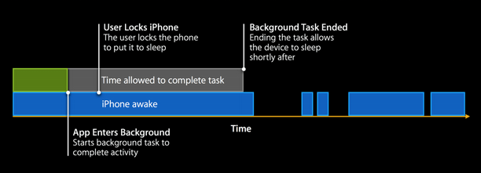</center>

而在iOS7中，后台任务的处理方式发生了改变，系统将在用户锁屛后，尽快让设备进入休眠状态，以节省电力，这时后台任务是被暂停的。之后设备在特定时间进行系统应用的操作被唤醒时（如检查邮件、来电等），之前暂停的后台任务将一起进行。也即，系统并不会专门为第三方应用保持设备处于活跃的状态。如下图所示：

<center>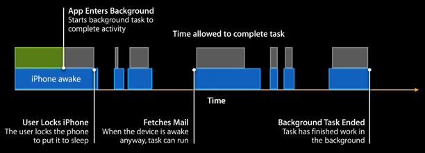</center>

<font color="red">iOS7之后系统，对于后台任务处理方式的这种变化，是需要实际验证的。然而，我通过一些Demo并未证实。So，求证~~</font>

2、后台任务的实现

一般来说，会有3分钟~10分钟的时间，但是API文档上并没有给出一个确切的时间。具体的运行时间取决于iOS系统，对于后台运行时间可以在UIApplication查询backgroundTimeRemaining，它会告诉你剩余多长时间。

应用在退到后台时，**applicationDidEnterBackground:applicatiion**会被调用。API文档上说明在真正进入后台之前，有5s的时间可以去完成一些工作，但是实际测试大概只有几十ms吧。所以，若要处理一些稍微长时间点的任务的话，最好是通过**beginBackgroundTaskWithExpirationHandler:handler**向系统申请更多的时间。使用此API还需要注意以下几点：

* handler会在backgroundTimeRemaining为0之前被执行，即在超时之前被执行，在这里我们需要做一些清理工作并通过**endBackgroundTask:**标记task结束。否则，如果超时导致此block被执行，但是没有调用**endBackgroundTask:**的话，app会被系统kill掉
* 此API必须与endBackgroundTask:identifier成对出现，这里的identifier就是上述API返回的对应后台任务的ID。需要通过此方法来通知系统后台任务完成，可以将app挂起。
  需要在两处调用此API:
  * 后台任务处理完成，调用endBackgroundTask:，尽快通知系统任务结束可以将app挂起
  * completionHandler block中，在超时之前，需要调用它通知系统
  
 否则，系统会kill掉应用，而不是让应用从后台模式进入挂起状态（注意：测试的时候应该真机运行测试，而不要通过Xcode调试状态去测试此情况） 

3、Demo演示与测试

说了这么多，贴点代码，我们来验证一下吧！

```
@interface AppDelegate () <NSURLSessionDelegate>
/**
 * 唯一标识后台任务的一个ID
 */
@property (nonatomic, unsafe_unretained) UIBackgroundTaskIdentifier backgroundTaskIdentifier;
@property (nonatomic, strong) NSTimer *myTimer;
@end


- (void)applicationDidEnterBackground:(UIApplication *)application {
    NSLog(@"did enter backgournd");
    
    // 当应用程序留给后台的时间快要到结束时（应用程序留给后台执行的时间是有限的）， 这个Block块将被执行
    // 我们需要在次Block块中执行一些清理工作。
    
    // 清理工作需要在主线程中用同步的方式来进行
    self. backgroundTaskIdentifier =[application beginBackgroundTaskWithExpirationHandler:^( void) {
        [self endBackgroundTask];
    }];
    
    // 模拟一个Long-Running Task
    [self dataTaskResume];                                              
}

-(void)dataTaskResume
{
    NSURL * url = [NSURL URLWithString:@"http://xmind-dl.oss-cn-qingdao.aliyuncs.com/xmind-7-update1-macosx.dmg"];
    
   // NSURLSessionDataTask * dataTask = [[self defaultURLSession] dataTaskWithURL:url];
    NSURLSessionDataTask * dataTask = [[self defaultURLSession] dataTaskWithURL:url
                                                          completionHandler:^(NSData * _Nullable data, NSURLResponse * _Nullable response, NSError * _Nullable error) {
        
                                                              [self endBackgroundTask];
    }];
    [dataTask resume];
    
}

- (NSURLSession *)defaultURLSession
{
    static NSURLSession * defaultSession = nil;
    static dispatch_once_t onceToken;
    dispatch_once(&onceToken, ^{
        NSURLSessionConfiguration * configuration = [NSURLSessionConfiguration defaultSessionConfiguration];
        
        defaultSession = [NSURLSession sessionWithConfiguration:configuration
                                                       delegate:self
                                                  delegateQueue:[NSOperationQueue mainQueue]];
    });
    return defaultSession;
}

-(void)endBackgroundTask{
    dispatch_queue_t mainQueue = dispatch_get_main_queue();
    AppDelegate *weakSelf = self;
    dispatch_async(mainQueue, ^(void) {
        
        AppDelegate *strongSelf = weakSelf;
        if (strongSelf != nil){
            [strongSelf.myTimer invalidate];// 停止定时器
            
            // 每个对 beginBackgroundTaskWithExpirationHandler:方法的调用,必须要相应的调用 endBackgroundTask:方法。这样，来告诉系统后台任务已经执行完，这样系统就可以将app挂起；否则，在执行完backgroundTask或者是超过了时间限制的话，系统会直接终止app.
            [[UIApplication sharedApplication] endBackgroundTask:self.backgroundTaskIdentifier];
            // 销毁后台任务标识符
            strongSelf.backgroundTaskIdentifier = UIBackgroundTaskInvalid;
        }
    });
}

```
通过以下case，我们对Background Task的能力进行了简单测试：

**case1** 启动应用后，退到后台，保持系统不进入休眠状态，通过Charles模拟慢网络情况，以致下载超过3min。

**case2** 启动应用后，退到后台，保持系统不进入休眠状态，正常速度下载，确保下载任务在3min之内完成。

**case3** 启动应用后，退到后台后，锁屏使应用进入休眠状态。

根据以上几种case，分别测试了调用endBackgroundTask和不调用它的结果。可以得出以下结论：

>
 应用退到后台后，无论系统是否进入休眠状态，系统都会分配3min的时间给后台任务执行。
 如果超过3min任务未完成，则会终止下载任务。
 如果endBackgroundTask:identifier没有在合适的地方调用，系统会kill掉进程；
 反之，系统会将应用挂起。

 
但是，这和Apple官方文档上给出的iOS7前后后台任务执行方式的变化图似乎有些出入。图中解释，iOS7之后，当用户锁屏致使系统休眠，后台任务会暂停，并通过一些零碎的时机去唤醒应用，继续未完的后台任务。而实际测试，anytime，后台任务都有3min钟的时间去持续执行。So,that's my confused.

**Anyway，Background Task更适合处理一些非耗时的网络传输的工作，而对于耗时的网络传输工作，iOS7给我们提供了一个大招：Background Transfer Service。GO ON，我们继续下一个新特性:Background Fetch!**

### Background Fetch

iOS7之前，诸如新闻、天气、社交应用等，此类应用有一个共同的缺点，即每次加载应用的时候，用户都需要等待应用从服务器获取最新数据。这一点如果体现在弱网环境下，就尤为明显了。

自iOS7以来，加入了新的后台模式，**后台获取**。系统会在后台不时的唤醒应用，获取最新的数据刷新UI。这样在用户打开应用的时候，最新的内容将已然呈现在用户眼前，而省去了所有的加载过程。后台获取是在应用程序挂起之前的30s时间执行工作的，因此并不适用于CPU频繁工作或者长时间运行任务，更适合于处理长时间运行的网络请求队列，或执行快速的内容更新等。

另外，系统执行获取会结合应用设置以及用户行为来给出一个合理的时间，这是一个自学习的过程。比如用户每天12点会刷一下微博，只要这个习惯持续三四天，系统就会将此时间调整到12点之前一点，这样每次打开应用都直接有最新内容的同时，也节省了电量和流量。

#### 使用Background Fetch

1. 启用Background Fetch模式

 如下图，打开Capabilities标签中设置Background Modes选项，勾选上Background Fetch。
 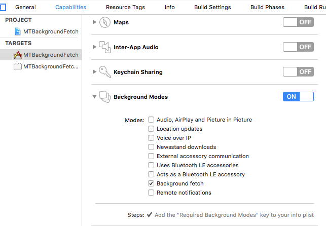
 
2. 实例设置获取间隔

	Fetch Interval一般在didFinishLaunchingWithOptions:方法中完成。
	
	```
	- (BOOL)application:(UIApplication *)application didFinishLaunchingWithOptions:(NSDictionary *)launchOptions
{
    // Override point for customization after application launch.
    
    [[UIApplication sharedApplication] setMinimumBackgroundFetchInterval:UIApplicationBackgroundFetchIntervalMinimum];
    return YES;
}
	```
Fetch Interval，是指系统唤醒应用并允许它加载数据的最低时间间隔。具体什么时候会进行后台获取，取决于系统。系统将根据App的设定，选择比如接收邮件的时候顺便为你的应用获取一下，或者也有可能专门为你的应用唤醒一下设备。对于获取时间间隔的设置，我们可以使用系统预定义的值，也可以使用自定义的NSTimeInterval类型的值。系统预定义的值有以下两个：
		
		UIApplicationBackgroundFetchIntervalMinimum：这个值会要求系统尽可能频繁地去管理应用什么时候应该被唤醒
		UIApplicationBackgroundFetchIntervalNever：这是系统默认的设置，表示永远不去后台获取。
 
 但是，后台获取越频繁，占用的资源就越多。iOS有一套自我保护的机制，会限制访问API过于频繁的应用。而且后台获取会导致电池消耗地过快，所以在设置自定义间隔的时候需谨慎。
		
3. 实现后台获取代码并通知系统
	
 这是完成Background Fetch的最后也是很关键的一步啦。AppDelegate同样提供了如下API让我们完成Fetch相关工作：

	```
	-(void)application:(UIApplication *)application performFetchWithCompleteHandler:handler
	
	```
系统在执行Fetch的时候会唤醒后台应用并执行此方法，我们只需要在此方法中完成获取工作，刷新UI，并通知系统fetch结束即可。同样，对于此API的使用也有一些注意点：
	* 系统提供的fetch时间最多30s(简单测试下来，大概也是这个时间），并非一个确定值，因此fetch只适合做一些简单的数据下载工作。
	* 当完成了网络请求和界面更新后，需要尽快执行completion handler来报告系统，系统会及时将app挂起，同时会更新页面快照。这样用户在应用间切换时，就可以看到新内容了。但是如果超过30s，系统没有收completionHandler的通知，则会kill掉应用。
	* 系统会根据completeHandler的调用时间评估Apps后台下载所耗电量和流量，选择分配后台获取的机会给不同Apps，从而平衡不同Apps和系统自身的需求（整体感知，没有细测）。
	* 一旦completion handler block被调用后，系统会利用剩余时间去计算后台下载所消耗的电量和流量。如果App下载数据量小而快，在下次获取后台fetch的时间可能性能更大些。反之，对于此类Apps，下载时间所花时间越长，或者通过completion handler block告知fetch结束，但实际上没有做任务下载相关的工作的，在下次获取后台fetch的机会就稍逊。

	看来想获取后台获取的机会还是得自己自觉好好把握啦。
	
	这里以获取知乎上RSS订阅内容的标题和更新时间为例，实现后台获取的功能：
	
	```
		//实现抓取的业务逻辑，并管理数据，刷新页面
	-(void)application:(UIApplication *)application performFetchWithCompletionHandler:(void (^)(UIBackgroundFetchResult))completionHandler{
	    
	    
	    NSDate *fetchStart = [NSDate date];
	    
	    ViewController *viewController = (ViewController *)self.window.rootViewController;
	    
	    [viewController fetchNewDataWithCompletionHandler:^(UIBackgroundFetchResult result) {
	        completionHandler(result);
	        
	        UIAlertView *alert = [[UIAlertView alloc] initWithTitle:@"test2" message:@"系统alertview" delegate:self cancelButtonTitle:@"fetch结束" otherButtonTitles:nil, nil];
	        [alert show];
	        
	        NSDate *fetchEnd = [NSDate date];
	        NSTimeInterval timeElapsed = [fetchEnd timeIntervalSinceDate:fetchStart];
	        NSLog(@"Background Fetch Duration: %f seconds", timeElapsed);
	        
	    }];
	}
	```
	在ViewController中定义public method，真正完成获取的工作
	
	```
	static NSString * NewsFeed = @"http://www.zhihu.com/rss";
	
	
	-(void)fetchNewDataWithCompletionHandler:(void (^)(UIBackgroundFetchResult))completionHandler{
	    XMLParser *xmlParser = [[XMLParser alloc] initWithXMLURLString:NewsFeed];
	    [xmlParser startParsingWithCompletionHandler:^(BOOL success, NSArray *dataArray, NSError *error) {
	        if (success) {
	            NSDictionary *latestDataDict = [dataArray objectAtIndex:0];
	            NSString *latestTitle = [latestDataDict objectForKey:@"title"];
	            
	            NSDictionary *existingDataDict = [self.arrNewsData objectAtIndex:0];
	            NSString *existingTitle = [existingDataDict objectForKey:@"title"];
	            
	            if ([latestTitle isEqualToString:existingTitle]) {
	                completionHandler(UIBackgroundFetchResultNoData);
	                
	                NSLog(@"No new data found.");
	            }
	            else{
	                [self performNewFetchedDataActionsWithDataArray:dataArray];
	                
	                completionHandler(UIBackgroundFetchResultNewData);
	                
	                NSLog(@"New data was fetched.");
	            }
	        }
	        else{
	            completionHandler(UIBackgroundFetchResultFailed);
	            
	            NSLog(@"Failed to fetch new data.");
	        }
	    }];
	}
	
	```
	这里还提供了两个button: Trash和Load，主要用来清除持久化的数据以及手动加载这些数据。也更方便我们对比Background Fetch与Foreground Fetch的体验差异化：
	
	```
	// 清除持久化数据
	- (IBAction)removeDataFile:(id)sender {
	    if ([[NSFileManager defaultManager] fileExistsAtPath:self.dataFilePath]) {
	        [[NSFileManager defaultManager] removeItemAtPath:self.dataFilePath error:nil];
	        
	        self.arrNewsData = nil;
	        
	        [self.tblNews reloadData];
	    }
	}
	
	// 前台手动加载数据
	- (IBAction)reloadData:(id)sender{
	    [self refreshData];
	}
	
	```
	
4. 模拟调试

  这里有两种调试方法：一种是从后台获取中启动应用，一种是当应用在后台时模拟一次后台推送。
  
  对于前者，我们可以新建一个Scheme来专门调度从后台启动。相关配置如下图：
  
  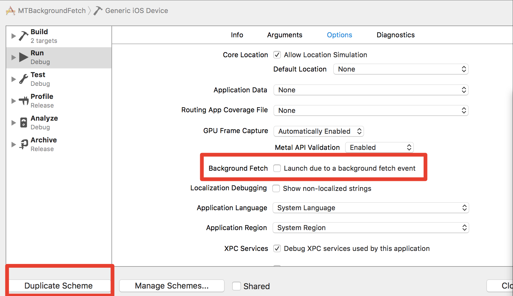
  
  点击Product->Scheme->Edit Scheme，在编辑Scheme的窗口中，按下Duplicate Scheme按钮复制一个当前方案，然后在新Scheme的option中将Background Fetch打上勾。从这个Scheme来运行应用时，应用将不会直接启动切入前台，而是调用后台获取部分代码并更新UI，这样再点击图标进入应用时，就可以看到最新数据和更新好的UI了。
  
  另一种是当应用在后台时，模拟一次后台获取。在App调试运行时，点击Xcode的Debug菜单中的Simulate Background Fetch，即可模拟完成一次获取调用。

戳戳戳->[完整的Background Fetch Demo源码](https://g.hz.netease.com/mobile-ios/document/tree/master/%E8%B0%83%E7%A0%94%E8%B5%84%E6%96%99/iOS%E5%A4%9A%E4%BB%BB%E5%8A%A1%E8%B0%83%E7%A0%94/Demo)在这里

####Background Fetch能力测试与验证

首先我们来看看使用Background Fetch与不使用其效果对比图：

<center>
<left>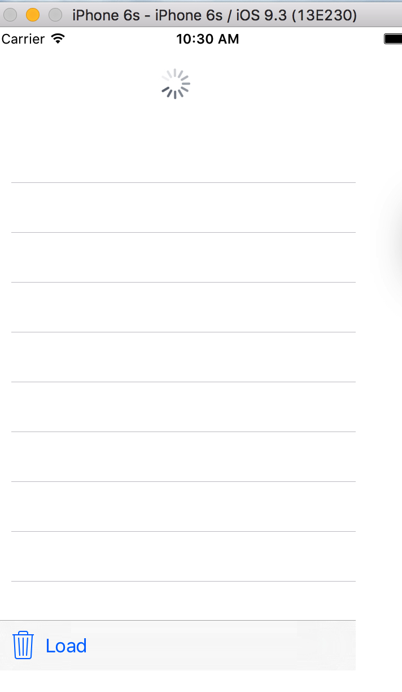
<right>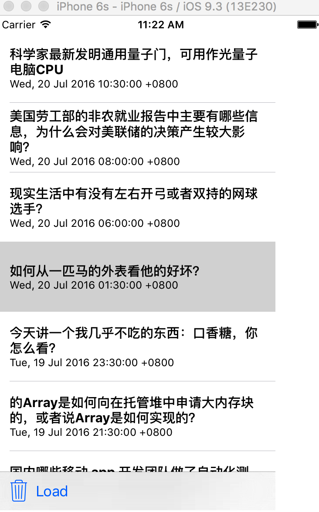
</center>

左图是直接前台加载的效果，如果是弱网环境下，转菊花的时间就会越久。右图则是经过后台获取后，直接进入应用的效果的。下面通过不同的case，验证和总结Background Fetch的能力。

**测试Case**

但是由于这个测试通过Xcode调试模式处理，结果与理论出入有些大。这里，我提供理论性的结论，大家有兴趣可以自测一下。

**case1** Fetch完后，调用CompletionHandler。模拟一次后台获取。
>理论上，30s后，应用被挂起。如果下载未完成，下载任务会中止。

**case2** Fetch完后，不调用CompletionHandler。模拟一次后台获取。
>理论上30s，应用应该被kill掉

**case5** 任何一种情况下，在后台获取的过程中，系统进入休眠。
>理论上，在这30s内进入休眠，对于后台获取无影响

**case6** 任何一种情况下，在后台获取的过程中，应用被中断而退出运行。
>理论上，在这30s内进入应用被中断而退出运行，对于后台获取无影响。

但是仍需提醒的是，频繁后台获取会过多消耗手机电量和流量，所以，后台获取虽好，可要慎重使用哦！

### Remote Notification

作为iOS7之后的另外一大新特性，Remote Notification的出现，大大改善了iOS应用的用户体验。类似于Background Fetch，Remote Notification也多用于新闻、天气、社交应用等应用。Remote Notification相比于Background Fetch，更适合用于那些偶尔出现，但却很重要的内容，如果使用后台获取模式中在两次获取间需要等待的时间是不可接受的话，远程通知会是一个不错的选择。远程通知会比后台获取更有效率，因为应用程序只有在需要的时候才会启动。

在了解Remote Notification之前，我们先来了解一下它的原理，这样即使以后遇到什么问题，我们出不会一脸蒙逼的样子~~哈哈

#### 远程推送原理

**1、传输路径**

Remote Notification(即PUSH系统）主要由4部分构成:

* Provider (生成notification的server）
* APNS
* Device
* Client App

其中，APNS是Remote Notification的核心部分，它是苹果所提供的一套服务，用于传递信息给ios(watchOS, tvOS, OS X)等设备。推送消息的传输路径如下图：

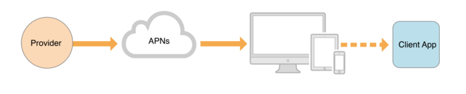

>
我们的设备联网时（无论是蜂窝网络或是Wi-Fi)都会与苹果的APNS服务器建立一个<font color="red">长连接</font>，当Provider推送一条通知的时候，它是先推送到苹果的APNS服务器上面，而苹果的APNS服务器再通过与设备建立的长连接进而把通知推送到我们的设备上。当设备处于非联网状态的时候，APNS服务器会保留Provider所推送的最后一条通知，设备转换为联网状态时，APNS会把其保留的最后一条通知推送给我们的设备；如果设备长时间处于非联网的状态下，那么APNS服务器为其保存的最后一条通知也会丢失。

**2、Device Token的生成**

Device Token简单理解就是包含了设备信息和应用信息（设备的UUID和APP的Bundle Identifier)的一串编码。deviceToken对于一台设备上的一个应用来说是唯一的，但是它并非固定不变的，比如我们重新安装应用时，对应的token就会改变。Provider在推送消息的时候必须带有此deviceToken，然后APNS会根据此deviceToken找到对应的设备以及设备上对应的应用，从而把此推送消息推送给此应用。

>当一个App注册接收远程通知的时候，系统会发送请求到APNS服务器，APNS服务器收到此请求后会根据请求所带的key值生成一个独一无二的value值也就是所谓的deviceToken，APNS服务器会把此deviceToken包装成一个NSData对象发送到对应请求的App上。此deviceToken是我们的Provide(server)在给我们的设备推送通知的时候，必须包含的内容。所以App在收到deviceToken后，需要把它发送给我们的服务器。

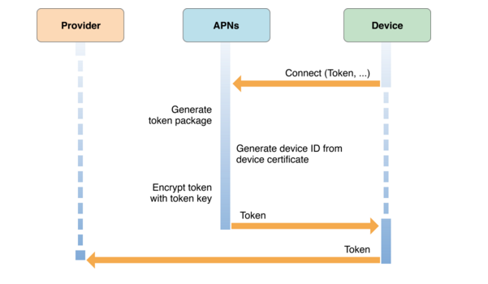

**3、Provider对Notification的生成**

Provider生成notification，对于每一个notification都会生成对应的payload(后面会详细介绍这一部分），并将其附加到http request中，发送给APNS server。APNS server会将些消息转发给对应的device，最后通过os将些notification转发到对应的App。自2015年7月份后，Apple更新了APNS的协议，基于HTTP2.0协议以及JSON数据传输，而在此之前，APNS是基于TLS socket连接完成通信过程的。简单地给出APNS新老通信协议的对比：

<center>
<left>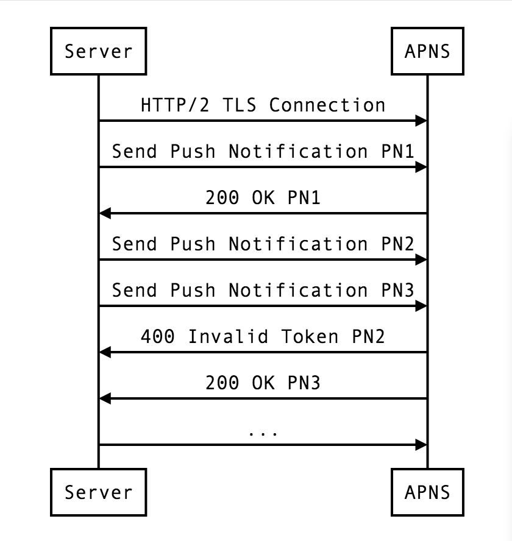
<right>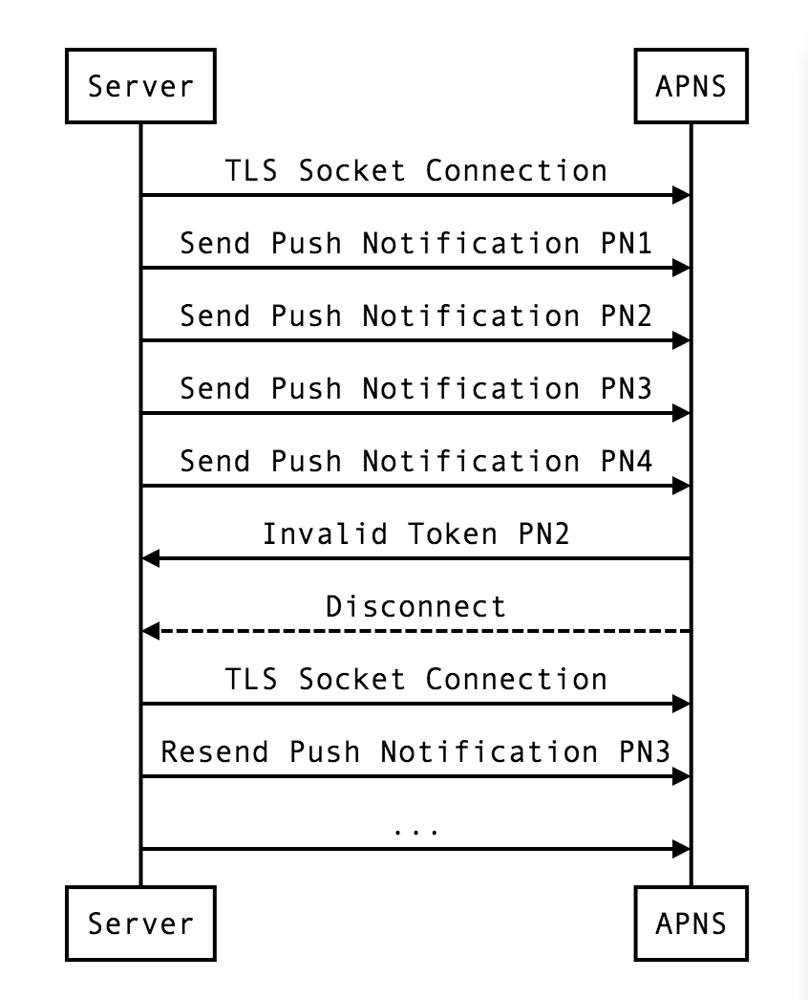
</center>

戳->[详细请看](https://dblog.laulkar.com/http2-protocol-for-apns.html)

#### Remote Notification介绍

1. IOS7之前
	
	* 推送类型单一，如显示标题、指定声音等
	* 仅支持代理方法处理notification：
	```
	- (void)application:(UIApplication *)application didReceiveRemoteNotification:(NSDictionary *)userInfo 
	```	
	* 用户可以收到Notification，但是只能进入应用之后才能响应push，获取数据，更新UI
	
	如下图所示：	
	<center></center>

	iOS7之前的Remote Notification与没有Background Fetch时获取数据刷新的问题是一样，用户进入应用后，必须等待数据加载的过程。
	
2. IOS7及之后 

	* 在接收到Remote Notification后，系统会唤醒设备和我们的后台应用，并先执行一段代码来准备数据和UI（时间有限），然后再提示用户有推送（唤醒App在后台运行。但是系统分配的后台运行时间不超过30s，经过测试也大概30s的样子。

	* 同时支持以下代理方法处理notification:
	
		```
		- (void)application:(UIApplication *)application didReceiveRemoteNotification:(NSDictionary *)userInfo 
		- (void)application:(UIApplication *)application didReceiveRemoteNotification:(NSDictionary *)userInfo fetchCompletionHandler:(void (^)(UIBackgroundFetchResult result))handler
		```
	关于这两个方法的区别会在后面介绍。
	下图是iOS7之后，Remote Notification组件关系图。
	
   <center></center>
	
	* Remote Notification也可以做到完全的Silent模式，在没有提醒消息或任何声音的情况下，只去更新应用界面或者触发后台工作。然后可以在完成下载或处理完更新内容后，发送一条本地通知。通过用户进入App。这个主要通过Payload去设置就可以实现，后面**使用方法**里会提到。
	
3. 使用场景

	类似于Background Fetch，Remote Notification也多用于新闻、天气、社交应用等应用。Remote Notification相比于Background Fetch，更适合用于那些偶尔出现，但却很重要的内容，如果使用后台获取模式中在两次获取间需要等待的时间是不可接受的话，远程通知会是一个不错的选择。远程通知会比后台获取更有效率，因为应用程序只有在需要的时候才会启动。
	
	同时，它也通常会结合Background Transfer Service去完成一些耗时较长的网络传输工作。

#### Remote Notification应用
1. 推送环境的配置
   
   这是一个比较复杂的过程，不是本篇文章的重点，[苹果证书配置](https://g.hz.netease.com/mobile/heartouch/tree/master/docs/Xcode/Certificates/苹果证书配置.md)一文比较清楚地介绍了Push环境的配置，大家可以作为参考。
   
2. 启用推送唤醒
	
	如下图直接使用Capabilities配置
	
	<center><left>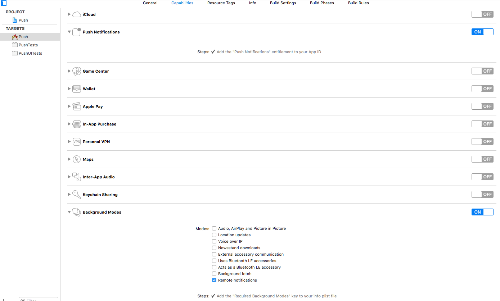</center>
	
3. 更改推送的payload
	
	Payload用来定义系统通知信息的Json数据结构，它由以下几部分组成：
	* alter: 消息的内容
	* badge: 标记notification的数目
	* sound: 提示音
	* content-available: 仅在iOS7之后支持，通过此属性，设置其为"Silent" remote notification，app在后台被唤醒，通过调用application:didReceiveRemoteNotification:fetchCompletionHandler:处理notification。
	
	切记，content-available是决定应用能否被在后台唤醒并执行上述回调的关键。（请示例）

	```
	 aps{
	 	alert:"My first push notification",
	 	badge: 1,
	 	sound: "default",
	 	content-available: 1
	 }
	```
	另外，上面介绍APNS的时候，有提到过，APNS对于Payload的大小是有限制的，大小也取决于通过协议。基于HTTP2协议，provider API能支持最大字节数据为4096bytes。
	
4. 注册Remote Notification(获取deviceToken)

	一般都是在App启动完成时去注册。远程通知注册方法的调用一般都在didFinishLaunchingWithOptions:方法中完成。
	
	```
	- (BOOL)application:(UIApplication *)application didFinishLaunchingWithOptions:(NSDictionary *)launchOptions {
	    // Override point for customization after application launch.
	    UIUserNotificationType types = UIUserNotificationTypeBadge | UIUserNotificationTypeSound | UIUserNotificationTypeAlert;
	    UIUserNotificationSettings *mySettings = [UIUserNotificationSettings settingsForTypes:types categories:nil];
	    [[UIApplication sharedApplication] registerUserNotificationSettings:mySettings];
	    [[UIApplication sharedApplication] registerForRemoteNotifications];
	    return YES;
	}
	
	//处理注册远程通知的回调方法
	-(void)application:(UIApplication *)application didRegisterForRemoteNotificationsWithDeviceToken:(nonnull NSData *)deviceToken{
	    
	    NSLog(@"Did Register for Remote Notifications with Device Token (%@)", deviceToken);
	}
	
	-(void)application:(UIApplication *)application didFailToRegisterForRemoteNotificationsWithError:(nonnull NSError *)error{
	    
	    NSLog(@"Did Fail to Register for Remote Notifications");
	    NSLog(@"%@, %@", error, error.localizedDescription);
	}

	```

3. 实现推送唤醒代码并通知系统
   
   iOS7添加了一个新的AppDelegate方法来处理Remote Notification，当接收到一条带content-available的推送通知时，此代理方法会被调用。iOS7之后的系统，都建议使用该方法来处理notification。
   
	```
	- (void)application:(UIApplication *)application didReceiveRemoteNotification:(NSDictionary *)userInfo fetchCompletionHandler:(void (^)(UIBackgroundFetchResult result))handler
```
	同样地，在使用此API时，也有一些需要注意到的地方：
	* 系统分配最多30s的时间，处理notification。超过30s，系统会再次将应用挂起。
	* API被调用场景:其一、App在前台、后台运行或挂起的状态下notification到来；其二、用户通过通知栏使App进入前台。所以，需要避免同一条notification被重复处理。在通过通知栏进入应用，且push回调被调用时，App的状态为UIApplicationStateInactive；而第一种情况下，App的状态为UIApplicationStateBackground；因此可以通过状态的不同，判断是哪种情况下触发的push回调。
	* 通常建议，使用Remote Notification，尽量使用Silent mode。App在后台处理完notification后后，再发送一条LocalNotification。这样用户通过通知栏进入应用后，便可直接展示最新的数据。也避免了上面提到的重复调用上述回调的问题。
	* fetchCompletionHandler需要在处理完notification后，马上调用。

	这里是这部分的实现代码。
	
	```
	-(void)application:(UIApplication *)application
	didReceiveRemoteNotification:(nonnull NSDictionary *)userInfo
	fetchCompletionHandler:(nonnull void (^)(UIBackgroundFetchResult))completionHandler
	{
	    [self dataTaskResumeWithCompletionHandler:completionHandler];
	    NSLog(@"%@", userInfo);
	}
	
	-(void)dataTaskResumeWithCompletionHandler:(nonnull void (^)(UIBackgroundFetchResult))completionHandler
	{
	    NSURL * url = [NSURL URLWithString:@"http://xmind-dl.oss-cn-qingdao.aliyuncs.com/xmind-7-update1-macosx.dmg"];
	    
	    NSURLSessionDataTask * dataTask = [[self defaultURLSession] dataTaskWithURL:url
	                                                              completionHandler:^(NSData *data, NSURLResponse * response, NSError * error)
	                                       {
	                                           
	                                           if (error == nil) {
	                                               NSString * text = [[NSString alloc] initWithData:data encoding:NSUTF8StringEncoding];
	                                               
	                                               NSLog(@"Data = %@", text);
	                                               completionHandler(UIBackgroundFetchResultNewData);
	                                           }
	                                           else{
	                                               completionHandler(UIBackgroundFetchResultFailed);
	                                           }
	                                           
	                                       }];
	    [dataTask resume];
	    
	}
	
	- (NSURLSession *)defaultURLSession
	{
	    static NSURLSession * defaultSession = nil;
	    static dispatch_once_t onceToken;
	    dispatch_once(&onceToken, ^{
	        NSURLSessionConfiguration * configuration = [NSURLSessionConfiguration defaultSessionConfiguration];
	        
	        defaultSession = [NSURLSession sessionWithConfiguration:configuration
	                                                                      delegate:nil
	                                                                 delegateQueue:[NSOperationQueue mainQueue]];
	    });
	    return defaultSession;
	}
	```


需要完全的PushDemo，包含Push脚本，请猛戳->[PushDemo源码下载](https://g.hz.netease.com/mobile-ios/document/tree/master/%E8%B0%83%E7%A0%94%E8%B5%84%E6%96%99/iOS%E5%A4%9A%E4%BB%BB%E5%8A%A1%E8%B0%83%E7%A0%94/Demo/Push)

####Remote Notification能力测试与验证
1、<font color="red">以content-available为主，对payload的设置对push影响进行测试</font>

**case1** 不设置content-available，应用只能进入前台后才能处理push消息，无异于iOS7之前的Noraml Push.

**case2** 设置content-availabel，同时设置其他项，如下：

```
	aps{
	 	alert:"My first push notification",
	 	badge: 1,
	 	sound: "default",
	 	content-available: 1
	 }
```
有Remote Notification的通知提示。

**case3** 设置payload，发送silent Remote Notification，如下:

```
	aps{
	 	alert:"My first push notification",
	 	content-available: 1
	 }
```
没有来自系统的通知提示。

2、<font color="red">以case3为基础进行Remote Notification的能力测试与验证，通过Charles模拟不同的网络环境，控制后台处理时间</font>

**case1** 应用处于前台时，发送Silent Remote Notification.

```
此时会当作一般的前台任务处理。一旦应用退到后台，或者设备锁屏，任务马上结束。
```

**case2** 应用处于后台时，发送Silent Remote Notification.

```
应用在后台被唤醒，开始处理下载任务。30s后，无论下载是否结束，应用被挂起。
如果没有调用fetchCompletionHandler通知系统的话，超过了30s，系统会终止应用。
期间，锁屏，任务马上结束。
```

**case3** 应用Cransh等Not-Running的状态，发送Silent Remote Notification.

```
应用在后台启动，开始处理下载任务。结果同上
```
**case4** 应用Force-quit后，发送Silent Remote Notification.

```
应用不会在后台被重新启动。
```

最后，关于Remote Notification做一下总结：

>Remote Notification会唤醒后台应用（或在后台重启应用），并最多分配30s的时间处理notification，如下载数据，更新UI等，其间任务的执行并不受系统休眠等影响。如果超过30s的时间，系统会将应用挂起。fetchCompletionHandler是用来通知系统，本地处理已经结束，系统可以更新界面快照并将应用挂起。但是，若系统没有及时收到此通知的话，应用可能会被kill掉。

>所以，仍然强调的是，Remote Notification多用于：IM，Email更新，RSS内容同步更新等，如果内容更新涉及下载较大文件的话，需要结合**Background Transfer Service**

###Background Transfer Service

**Background Transfer Service**是iOS7系统以来，作为多任务变革大招中最后一式，既可以作为一个很好的方式独立应用于项目中，也可以与Background Task、Background Fetch、Remote Notification进行完美结合，更好地服务于你的需求。
 
后台传输服务是基于Background Session来实现的，我们通过backgroundSessionConfiguration创建的session，实际是系统另起了一个后台进程来处理传输任务。所以，当应用退到后台或者是应用崩溃等终止运行了，并不影响后台传输进程正常运行。
   
当基于此background session的所有任务都完成时（成功or失败），系统都会唤醒后台应用（如果应用是退到后台）或者在后台重启应用（如果应用终止运行了）。并且会触发Application的代理方法：[application:handleEventsForBackgroundURLSession:completionHandler](https://developer.apple.com/library/ios/documentation/UIKit/Reference/UIApplicationDelegate_Protocol/index.html#//apple_ref/occ/intfm/UIApplicationDelegate/application:handleEventsForBackgroundURLSession:completionHandler:)，系统通过此代理方法，告知我们：（1）唤醒应用的后台session的Identifier，（2）在与此session以及与session相关的任务处理结束后，需要通过系统的回调。
   
   当与此session相关的所有消息都发送完毕后，应用会收到[URLSessionDidFinishEventsForBackgroundURLSession](https://developer.apple.com/library/ios/documentation/Foundation/Reference/NSURLSessionDelegate_protocol/index.html#//apple_ref/occ/intfm/NSURLSessionDelegate/URLSessionDidFinishEventsForBackgroundURLSession:)消息。我们需要在方法中完成一些诸如界面更新等的工作，并且调用上述completionHanlder，通知系统应用可以进入休眠状态。
   
   接下来，我们直接根据一个Demo APP，来了解如何使用NSURLSession API实现后台传输服务，包括以下几步：
  
   * 如何开始下载进程
   * 应用在前台运行时，如何追踪下载状态等信息
   * 应用退到后台或不在运行时，后台下载结束，系统如何与应用交互，更新下载状态及UI
   * 如果应用重启时，后台session还未结束，如何处理？（因为可能会出现同一个identifier对应两个session对象）
   
####后台传输的实现

下面是我们Demo App的截图，主要结合NSURLSession和NSURLSessionDownlaodTask实现简单的支持后台下载的文件下载管理。
<center>
<left>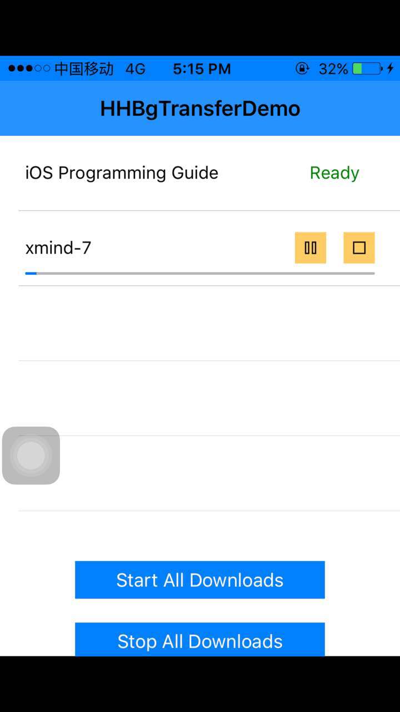
</center>

为了实现简单的文件下载管理功能，我们需要对下载信息进行持久化，这里通过Sqlite来实现。定义下载信息数据结构如下：

```
@interface FileDownloadInfo : NSObject

@property (nonatomic, strong) NSString *fileTitle;

@property (nonatomic, strong) NSString *downloadSource;

@property (nonatomic, strong) NSURLSessionDownloadTask *downloadTask;

@property (nonatomic, strong) NSData *taskResumeData;

@property (nonatomic) double downloadProgress;

@property (nonatomic) HTFileTransferState status;

@property (nonatomic) unsigned long taskIdentifier;

@end
```
前期工作准备好后，我们主要实现以下步骤：

* 创建一个Background Session对象
* 初始化下载任务列表，创建task，并通过resume方法开始下载
* 获取文件下载进度，并持久化下载进度信息

	```
	- (void)URLSession:(NSURLSession *)session downloadTask:(NSURLSessionDownloadTask *)downloadTask didWriteData:(int64_t)bytesWritten totalBytesWritten:(int64_t)totalBytesWritten totalBytesExpectedToWrite:(int64_t)totalBytesExpectedToWrite
	
	```
* 处理文件下载结束的相关工作：

	```
	- (void)URLSession:(NSURLSession *)session downloadTask:(NSURLSessionDownloadTask *)downloadTask
                   didFinishDownloadingToURL:(NSURL *)location;
	- (void)URLSession:(NSURLSession *)session task:(NSURLSessionTask *)task
	                           didCompleteWithError:(NSError *)error;
	```                          
* 实现AppDelegate的代理方法application:handleEventsForBackgroundURLSession:completionHandler:，
* 实现URLSession的代理方法URLSessionDidFinishEventsForBackgroundURLSession:，在此调用前一步骤中的completionHandler，通知系统此background session的所有任务完毕，App可以进入休眠状态

**下面我们进入关键代码的演示与分析**

```
//创建后台session对象
-(NSURLSession *)backgroundSession
{
    static NSURLSession * session = nil;
    static dispatch_once_t onceToken;
    dispatch_once(&onceToken, ^{
        NSURLSessionConfiguration *sessionConfiguration = [NSURLSessionConfiguration backgroundSessionConfiguration:@"com.BGTransferDemo"];
        sessionConfiguration.HTTPMaximumConnectionsPerHost = 5;
        
        session = [NSURLSession sessionWithConfiguration:sessionConfiguration
                                                delegate:self
                                           delegateQueue:nil];
    });
    
    return session;
}

// 初始化下载任务列表，需要与DB里面的下载对象做merge
-(void)initializeFileDownloadDataArray{
    self.arrFileDownloadData = [[NSMutableArray alloc] init];
    
    [self.arrFileDownloadData addObject:[[FileDownloadInfo alloc] initWithFileTitle:@"iOS Programming Guide" andDownloadSource:@"https://developer.apple.com/library/ios/documentation/iphone/conceptual/iphoneosprogrammingguide/iphoneappprogrammingguide.pdf"]];
    
    [self.arrFileDownloadData addObject:[[FileDownloadInfo alloc] initWithFileTitle:@"xmind-7" andDownloadSource:@"http://xmind-dl.oss-cn-qingdao.aliyuncs.com/xmind-7-update1-macosx.dmg"]];
    
    NSArray<FileDownloadInfo *> *itemsFromDB = [_databaseManager allDownloadItems];
    for (int i = 0; i < _arrFileDownloadData.count; i++) {
        NSUInteger foundDownloadItemIndex = [itemsFromDB indexOfObjectPassingTest:^BOOL(FileDownloadInfo * _Nonnull obj, NSUInteger idx, BOOL * _Nonnull stop) {
            FileDownloadInfo * item = _arrFileDownloadData[i];
            if ([obj.fileTitle isEqualToString:item.fileTitle]) {
                return YES;
            }
            return NO;
        }];
        
        if (foundDownloadItemIndex != NSNotFound) {

            FileDownloadInfo * itemFromDB = [itemsFromDB objectAtIndex:foundDownloadItemIndex];
            _arrFileDownloadData[i].downloadProgress = itemFromDB.downloadProgress;
            _arrFileDownloadData[i].taskResumeData = itemFromDB.taskResumeData;
            _arrFileDownloadData[i].status = itemFromDB.status;
            _arrFileDownloadData[i].taskIdentifier = itemFromDB.taskIdentifier;
            
            if (itemFromDB.status == HTFileTransferStateTransfering) {
                _arrFileDownloadData[i].isDownloading = YES;
            }
            if (itemFromDB.status == HTFileTransferStateDone) {
                _arrFileDownloadData[i].downloadComplete = YES;
            }
        }
    }
}
```

**省略了构建tableview的细节，直接进入下一步**

```
//启动所有下载任务，并更新数据库
- (IBAction)startAllDownloads:(id)sender {
    // Access all FileDownloadInfo objects using a loop.
    for (int i=0; i<[self.arrFileDownloadData count]; i++) {
        FileDownloadInfo *fdi = [self.arrFileDownloadData objectAtIndex:i];
        
        // Check if a file is already being downloaded or not.
        if (fdi.downloadComplete) {
            continue;
        }
        if (!fdi.isDownloading) {
            // Check if should create a new download task using a URL, or using resume data.
            if (fdi.taskIdentifier == -1) {
                fdi.downloadTask = [self.session downloadTaskWithURL:[NSURL URLWithString:fdi.downloadSource]];
            }
            else{
                fdi.downloadTask = [self.session downloadTaskWithResumeData:fdi.taskResumeData];
            }
            
            // Keep the new taskIdentifier.
            fdi.taskIdentifier = fdi.downloadTask.taskIdentifier;
            fdi.status = HTFileTransferStateTransfering;
            [_databaseManager updateOrInsertDownloadItem:fdi];
            // Start the download.
            [fdi.downloadTask resume];
            
            // Indicate for each file that is being downloaded.
            fdi.isDownloading = YES;
        }
        else{
            
        }
    }
    
    // Reload the table view.
    [self.tblFiles reloadData];
}
```

**实现相关Delegate方法**

```
//此代理方法是必须实现的。文件下载完成后，将文件从临时目录写入定制化的其他目录，并更新数据库中的下载信息
-(void)URLSession:(NSURLSession *)session downloadTask:(NSURLSessionDownloadTask *)downloadTask didFinishDownloadingToURL:(NSURL *)location{
    
    NSError *error;
    NSFileManager *fileManager = [NSFileManager defaultManager];
    
    NSString *destinationFilename = downloadTask.originalRequest.URL.lastPathComponent;
    NSURL *destinationURL = [self.docDirectoryURL URLByAppendingPathComponent:destinationFilename];
    
    if ([fileManager fileExistsAtPath:[destinationURL path]]) {
        [fileManager removeItemAtURL:destinationURL error:nil];
    }
    
    BOOL success = [fileManager copyItemAtURL:location
                                        toURL:destinationURL
                                        error:&error];
    
    if (success) {
        int index = [self getFileDownloadInfoIndexWithTaskIdentifier:downloadTask.taskIdentifier];
        FileDownloadInfo *fdi = [self.arrFileDownloadData objectAtIndex:index];
        
        fdi.isDownloading = NO;
        fdi.downloadComplete = YES;
        
        fdi.status = HTFileTransferStateDone;

        fdi.taskResumeData = nil;
        [_databaseManager updateDownloadItem:fdi];
        
        [[NSOperationQueue mainQueue] addOperationWithBlock:^{
            // Reload the respective table view row using the main thread.
            [self.tblFiles reloadRowsAtIndexPaths:@[[NSIndexPath indexPathForRow:index inSection:0]]
                                 withRowAnimation:UITableViewRowAnimationNone];
            
        }];
        
    }
    else{
        NSLog(@"Unable to copy temp file. Error: %@", [error localizedDescription]);
    }
}

//实现此代理方法，获取文件下载的进度信息，同时将其更新到DB中
-(void)URLSession:(NSURLSession *)session downloadTask:(NSURLSessionDownloadTask *)downloadTask didWriteData:(int64_t)bytesWritten totalBytesWritten:(int64_t)totalBytesWritten totalBytesExpectedToWrite:(int64_t)totalBytesExpectedToWrite{
    
    if (totalBytesExpectedToWrite == NSURLSessionTransferSizeUnknown) {
        NSLog(@"Unknown transfer size");
    }
    else{
        // Locate the FileDownloadInfo object among all based on the taskIdentifier property of the task.
        int index = [self getFileDownloadInfoIndexWithTaskIdentifier:downloadTask.taskIdentifier];
        FileDownloadInfo *fdi = [self.arrFileDownloadData objectAtIndex:index];
      
        fdi.downloadProgress = (double)totalBytesWritten / (double)totalBytesExpectedToWrite;
        
        [[NSOperationQueue mainQueue] addOperationWithBlock:^{
            
            UITableViewCell *cell = [self.tblFiles cellForRowAtIndexPath:[NSIndexPath indexPathForRow:index inSection:0]];
            UIProgressView *progressView = (UIProgressView *)[cell viewWithTag:CellProgressBarTagValue];
            progressView.progress = fdi.downloadProgress;
        }];
        
        NSDate * currentDate = [NSDate date];
        NSTimeInterval time = [currentDate timeIntervalSinceDate:_lastDate];
        if (time >= 1 || totalBytesWritten == totalBytesExpectedToWrite){
            _lastDate = currentDate;
            [_databaseManager updateDownloadItem:fdi];
            
            NSLog(@"[HTFileDownloader]: Progress update: %f)", fdi.downloadProgress);
        }
    }
}

```

**处理后台下载**

当应用不在前台或未启动，但是后台传输在进行时，每一次后台传输进程有消息到来，都会调用 **application:handleEventsForBackgroundURLSession:completionHandler:**，来唤醒应用。
此方法有两个参数：

* identifier:是对应background session的id，用来关联这些任务的session。如果在所有的后台任务完成时，App不是running的状态，那么系统在后台重新启动App后，需要通过此id创建background session对象，才能接收与此session相关的代理事件。如果App从后台状态被唤醒，则无须重新创建session对象，任何代理事件会直接关联到这个已经存在的session上。
* completionHandler:需通过此block通知系统更新页面快照，app可以再次进入休眠状态。completionHandler必须在此方法中被保存一份，并在所有downloads相关工作处理完成之后被调用，以通知系统可以应用可以再次进入休眠状态。

```
//此处只对completionHandler进入一次copy，backgroundSession的创建在应用启动初始化的工作中一并处理
-(void)application:(U
IApplication *)application handleEventsForBackgroundURLSession:(NSString *)identifier completionHandler:(void (^)())completionHandler{
    
    self.backgroundTransferCompletionHandler = completionHandler;
    
}
```
当系统已经没有其他的messages通知给应用时，NSURLSession的代理方法URLSessionDidFinishEvensForBackgroundURLSession:会被调用。所以我们需要实现此方法，并调用上述completionHandler

```
-(void)URLSessionDidFinishEventsForBackgroundURLSession:(NSURLSession *)session{
    AppDelegate *appDelegate = [UIApplication sharedApplication].delegate;
    
    // Check if all download tasks have been finished.
    [self.session getTasksWithCompletionHandler:^(NSArray *dataTasks, NSArray *uploadTasks, NSArray *downloadTasks) {
        
        if ([downloadTasks count] == 0) {
            if (appDelegate.backgroundTransferCompletionHandler != nil) {
                // Copy locally the completion handler.
                void(^completionHandler)() = appDelegate.backgroundTransferCompletionHandler;
                
                // Make nil the backgroundTransferCompletionHandler.
                appDelegate.backgroundTransferCompletionHandler = nil;
                
                [[NSOperationQueue mainQueue] addOperationWithBlock:^{
                    // Call the completion handler to tell the system that there are no other background transfers.
                    completionHandler();
                    
            }
        }
    }];
}
```

继续戳->[完成的Demo源码](https://g.hz.netease.com/mobile-ios/document/tree/master/%E8%B0%83%E7%A0%94%E8%B5%84%E6%96%99/iOS%E5%A4%9A%E4%BB%BB%E5%8A%A1%E8%B0%83%E7%A0%94/Demo)

####Background Transfer Service能力测试与验证
这里列举几种case，通过Charles抓包分析，对后台传输服务的能力进行简单总结。

**case1** 应用处于前台的时候，进行下载

**case2** 下载过程中，应用退到后台
>下载不受限地在后台继续进行。在下载完成之前，应用切换到前台，下载界面保持最新的状态，直至下载结束；
>在所有下载完成后，App Switcher中页面快照被更新。进入前台，下载界面被更新，下载完成。
 
**case3** 下载过程中，应用crash而终止，下载在后台继续进行
>在下载完成之前，应用启动进入前台，下载界面被更新，下载在前台正常进行，直至结束
>在下载完成之后，App Switcher中页面快照被更新。应用启动进入前台，下载界面被更新，下载完成.
  
**case4** 下载过程中，应用被强制退出，下载立即停止

So，不同于前面几种后台模式，**Background Transfer Service**通过独立的后台进程接管下载任务。所以，当应用退到后台或者是应用因crash等被中断运行(除了force-quit)，并不影响后台下载进程继续运行。如果下载完成时，应用处于后台suspend的状态，那么系统会在后台唤醒应用；如果应用没有运行的话，会在后台启动应用。然后在相应的回调中，执行下载结束之后所要处理的相关工作。

**Background Transfer Service**特别适合于一些大文件的传输，如果配合Background Fetch，Remote Notification的话，就可以满足我们应用开发过程中的更多需求。

##总结

iOS7以来，强大的多任务和网络API为现有应用和新应用开启了一系列全新的可能性。如果你的应用程序可以从进程外的网络传输和数据中获益，那么尽情地使用这些美妙的API。一般情况下，你可以就像你的应用正在前台运行那样去实现后台传输，并进行适当的界面更新，而这里绝大多数的工作都已经为你完成了。

* 使用适当的新 API 来为你的应用程序提供内容。
* 尽可能早地调用 completion handler 以提高效率。
* 让 completion handler 为应用程序更新界面快照


##参考文档
[Background Execution](https://developer.apple.com/library/ios/documentation/iPhone/Conceptual/iPhoneOSProgrammingGuide/BackgroundExecution/BackgroundExecution.html)

[iOS7的多任务-en](https://www.objc.io/issues/5-ios7/multitasking/)

[iOS7的多任务-cn](https://objccn.io/issue-5-5/)

[iOS应用程序生命周期](http://blog.csdn.net/totogo2010/article/details/8048652)

[WWDC 2013 Session笔记 - iOS7中的多任务](WWDC 2013 Session笔记 - iOS7中的多任务)

[What's New with Multitasking](http://asciiwwdc.com/2013/sessions/204)

[What's New in Foundation Networking](https://developer.apple.com/videos/play/wwdc2013/705/)

[Using Local And Push Notifications on iOS and Mac OS X](https://developer.apple.com/videos/play/wwdc2011/517/)

[Local and Remote Notification Programming Guide](https://developer.apple.com/library/mac/documentation/NetworkingInternet/Conceptual/RemoteNotificationsPG/Chapters/Introduction.html)

[iOS的后台运行和多任务处理](http://www.molotang.com/articles/1480.html)

[iOS后台运行实现总结](http://www.jianshu.com/p/d3e279de2e32)

[iOS推送之远程推送](http://www.jianshu.com/p/4b947569a548)

[iOS推送之本地推送](http://www.jianshu.com/p/4b947569a548)

[objc-from-urlconnection-to-urlsession](https://www.objc.io/issues/5-ios7/from-nsurlconnection-to-nsurlsession/)

[Using NSURLSession](https://developer.apple.com/library/ios/documentation/Cocoa/Conceptual/URLLoadingSystem/Articles/UsingNSURLSession.html#//apple_ref/doc/uid/TP40013509-SW1)

[Life Cycle of a URL Session](https://developer.apple.com/library/ios/documentation/Cocoa/Conceptual/URLLoadingSystem/NSURLSessionConcepts/NSURLSessionConcepts.html#//apple_ref/doc/uid/10000165i-CH2-SW1)


