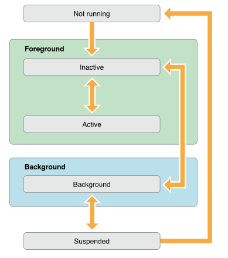

本文主要结合Apple一系列官方文档、WWDC、以及相关博文的学习，并配合自己的一系列测试，对iOS7之后的多任务进行了总结。在了解iOS的多任务方式之前，对于iOS的应用程序的生命周期也需要有个清晰的认识。所以，文章将按照如下章节来介绍iOS7及其后系统多任务的新特性：

* iOS应用程序运行状态
* iOS多任务的发展
* iOS7多任务之新特性

## iOS应用程序运行状态

应用程序的状态有以下状态：

1. Not Running: App已经终止，或者还未启动
2. InActive : App处于前台但不再接收事件（eg:用户处于活动时锁住了设备）。
3. Active	 : App处于在前台运行而且接收到了事件，这是前台的一个正常模式
4. Background : 程序在后台而且能执行代码，大多数程序进入这个状态后会在在这个状态上停留一会。时间到之后会进入挂起状态(Suspended)。有的程序经过特殊的请求后可以长期处于Backgroud状态
5. Suspend : App驻留内存，但不再执行代码。系统会自动把程序变成这个状态而且不会发出通知。当挂起时，程序还是停留在内存中的，当系统内存低时，系统就把挂起的程序清除掉，为前台程序提供更多的内存。

下图是应用程序各状态的变化图：

<center></center>

对应不同状态切换时，会触发不同的回调函数：

``` objectivec
告诉代理对象，应用启动过程结束，准备开始运行
- (BOOL)application:(UIApplication *)application didFinishLaunchingWithOptions:(NSDictionary *)launchOptions

当应用程序将要入非活动状态执行，在此期间，应用程序不接收消息或事件，比如来电话了
- (void)applicationWillResignActive:(UIApplication *)application

当应用程序入活动状态执行，这个刚好跟上面那个方法相反
- (void)applicationDidBecomeActive:(UIApplication *)application 

当程序被推送到后台的时候调用。所以要设置后台继续运行，则在这个函数里面设置即可
- (void)applicationDidEnterBackground:(UIApplication *)application

当程序从后台将要重新回到前台时候调用，这个刚好跟上面的那个方法相反。
- (void)applicationWillEnterForeground:(UIApplication *)application

当程序将要退出是被调用，通常是用来保存数据和一些退出前的清理工作。这个需要要设置UIApplicationExitsOnSuspend的键值。
- (void)applicationWillTerminate:(UIApplication *)application
```